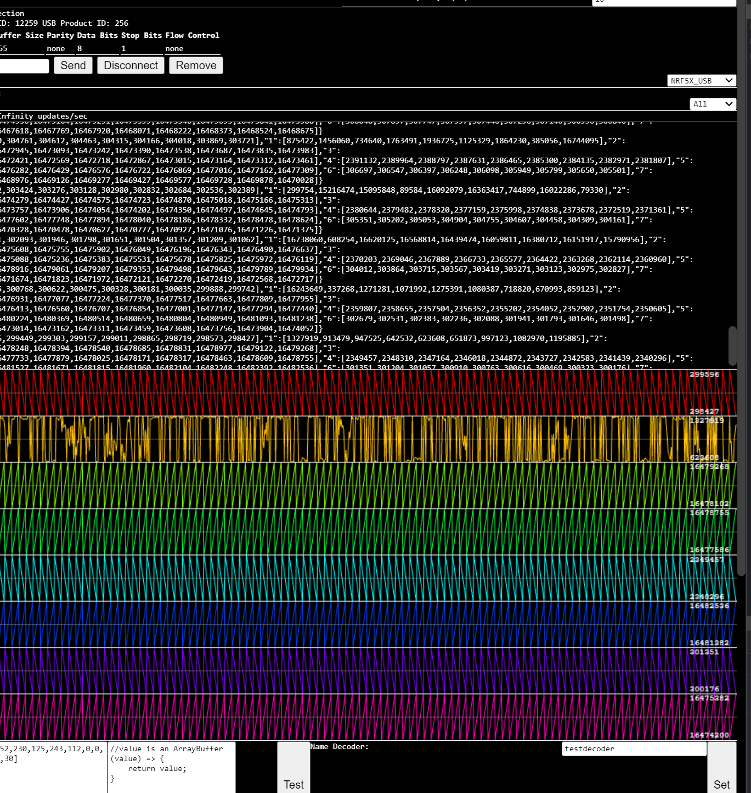

To run:

`tinybuild` or `npm i -g tinybuild & tinybuild`

Multiple concurrent BLE and USB Serial device debugger with programmable decoders and selective interaction with each device/ble service characteristic. Produces a little debugger window for each connected device with individual controls and output consoles.

Live demo: https://devicedebugger.netlify.app

Uses the @capacititor-community/ble library which can be dropped right into native mobile applications without changing your code. It uses the Web Serial API for USB, which is not available on mobile.

TODO:
- more styling & thorough testing
- charting, console toggles and controls
- implement selective biquad filters on channels on decoder thread
- csvs

Features [graphscript](https://github.com/brainsatplay/graphscript) to script the site efficiently.

