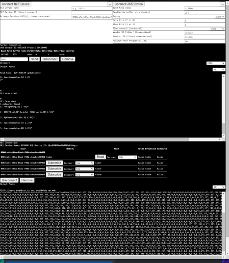

## General purpose BLE and USB browser debugger
The BLE will bundle to mobile too, we will release an APK of this app to test.

This app is a multiple concurrent BLE and USB Serial device debugger with programmable decoders and selective interaction with each device/ble service characteristic. Produces a little debugger window for each connected device with individual controls and output consoles/charts. Hover over the chart for more controls.

Live demo: https://devicedebugger.netlify.app

#### To run:

`tinybuild` or `npm i -g tinybuild & tinybuild`

#### Features: 
- Generate consoles and charts for each connected BLE and Serial device. Decode raw data using our presets or write-in your own decoders. Each serial device or notification stream gets dedicated workers for parsing and charting data. 
- See BLE services based on the primary service characteristics you provide (due to security rules in browser you need to know the UUIDs)
- Apply digital filters and scalars to charts, toggle lines being viewed, attempt to generate lines in unknown streams
- Parse UTF8 and arduino-like debug streams e.g. 'red: 123 \t blue:345 \r\n'
- Set endstops bytes in serial streams, write-in custom decoders or look at src/devices/index.ts for how to integrate your own decoder, charting, and filtering preset rules into the browser.

- For BLE: @capacitor-community/ble library so this can be dropped right into native mobile applications without changing your code. 
- For USB: Web Serial API, which is not available on mobile.

#### TODO:
- csvs on a data collection thread, use indexeddb to prevent memory overflows
- more styling, bug proofing
- modularize the frontend and worker construction better, package the standalone Serial and BLE wrappers

#### Why?

We need this for our own hardware but we wanted to produce a proper web benchmark and debugger tool for Serial and BLE sensors in general.

Features [graphscript](https://github.com/brainsatplay/graphscript) to script the site efficiently.

